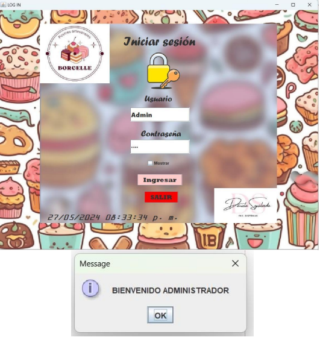
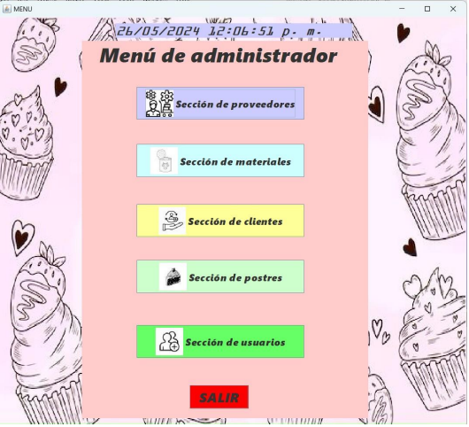
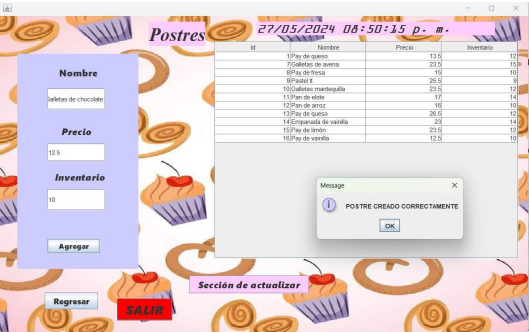

# PostreSoft - Pastry Shop Management System

PostreSoft is a Java desktop application designed to manage the operations of a pastry shop.  
The application allows administrators to manage products, customers, suppliers, materials, and inventory through a graphical user interface connected to a relational database.

This project demonstrates the implementation of a desktop CRUD system with database integration using Java and MySQL.

---

## Project Overview

PostreSoft was developed as part of a university software development and database systems project.  
The objective was to build a functional management system capable of handling the basic operations of a pastry shop.

The system allows administrators to:

- Manage pastry products
- Manage customers
- Manage suppliers
- Manage materials
- Control inventory
- Store information in a relational database

---

## Features

- Product management
- Customer management
- Supplier management
- Materials management
- Inventory control
- Database integration
- Graphical user interface for administration

---

## Technologies Used

- Java
- Java Swing (GUI)
- MySQL
- SQL
- JDBC
- NetBeans IDE

---

## System Architecture

The system follows a basic layered structure:

- Graphical Interface: Java Swing
- Business Logic: Java classes
- Database Access: JDBC
- Database: MySQL

The application performs CRUD operations to store and retrieve data from the database.

---

## Screenshots

### Login Interface

### Administrator Menu

### Product Management

---

## Project Structure

postresoft-java-system
│
├── src/ → Application source code
├── nbproject/ → NetBeans project configuration
├── database/ → Database scripts
├── docs/ → Project documentation
├── images/ → System screenshots
└── README.md → Project description

---

## Demo Credentials

Default administrator account:

Username: admin  
Password: admin

---

## Installation

1. Clone the repository

git clone https://github.com/ingdani2901/postresoft-java-system.git

2. Import the project into NetBeans IDE

3. Create the database using the SQL file located in:

database/pasteleria.sql

4. Configure the database connection in the project

5. Run the application from NetBeans

---

## Documentation

This repository includes the following documentation:

- User Manual → explains how to use the system
- Project Documentation → describes the project development
- Code Explanation → detailed explanation of the code structure

These files can be found in the `docs` folder.

---

## Author

Daniela Sepúlveda Gómez  
Computer Systems Engineering Student  

GitHub: https://github.com/ingdani2901
